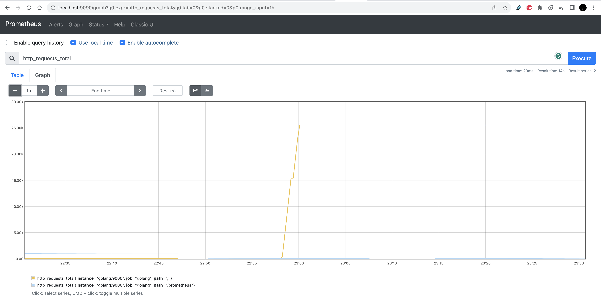

# Integrating Prometheus and Grafana with Golang 

This repository contains the source code for integrating Prometheus and Grafana with Golang . 
## Prerequisites

Before running the prometheus-golang, make sure you have the following prerequisites installed on your system:

- Go programming language (go1.21)

## Installation

1. Clone the repository:

   ```bash
   git clone https://github.com/ankitchahal20/prometheus-golang.git
   ```

2. Navigate to the project directory:

   ```bash
   cd prometheus-golang
   ```

3. Install the required dependencies:

   ```bash
   go mod tidy
   ```
4. docker-compose -d up

5. prometheus dashboard will be up at http://localhost:9090/graph and Grafana dashboard will be up at http://localhost:3000/ pls use login and password as admin, if you accessing it for the very first time. To find the ip-address where prometheus is running 
`docker inspect -f '{{range.NetworkSettings.Networks}}{{.IPAddress}}{{end}}' prometheus-container-id`, use this IP address while setting the prometheus as data source.




